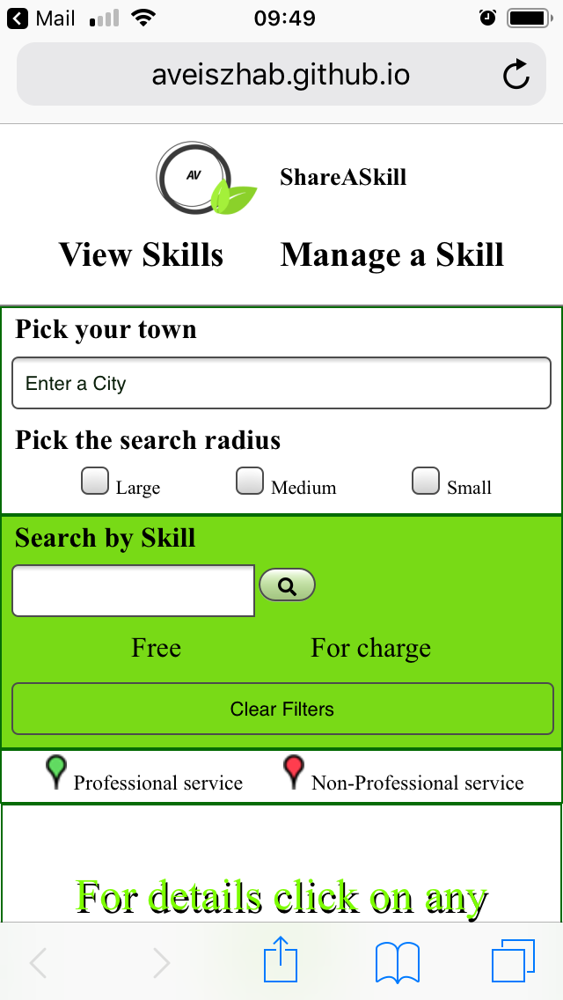

# ShareASkill app
Manchester Codes Software Engineer FastTrack course – Final project

This Google Map based app enables people to share their skills and other people in need for services to list, and filter those skills. The skills are stored in MongoDB Atlas global cloud database service which is connected to the app through an API https://github.com/aveiszhab/find-skill.api.

The introduction video is available on Youtube https://www.youtube.com/watch?v=LpAOsyFB2bA.

# Deployment
The app was deployed on GitHub pages: https://aveiszhab.github.io/find-skill/#/

# Screenshots
## Mobile
   
## Desktop
  
# Development utilities used:

* The App was built using REACT
* Testing: Jest, React Testing Library
* Packages: Axios, PropTypes, qs

# How to use the app
## If you have a skill to share
* Click on "Manage a Skill" on the navigaton bar
* Fill the form and click on the "Add" button
* If it was successful. You should be able to see a green confirmation message on the top of the screen
* Click on "View Skills" on the navigation bar and you should be able to find your marker on the map (for details see the next section)
## If you are looking for a service
* Click on "View Skills" on the navigation bar
* Start typing the name of your city into the searchbox in the top right corner and pick from the list. That step will center the map to your area.
* Change the search radius with the radio buttons below the searchbox (you can use the normal scrolling features of Google map to)
* For filtering the skills in your area you can serch by the name of the service. Simply type it in into the second searchbox e.g.: sing
* Yo can filter the matches by free and chargeable too.
* Click on a Marker so details will be shown in the middle window on the right side

# To run the App locally
* Clone the repo:
git@github.com:aveiszhab/find-skill.git

* Install the project dependencies with npm i

* Based on the .env.example create a .env files on the route of your project.
    * GOOGLE_MAP_API_KEY: replace \<Your Google API key> with the key you created on Google cloud patform. Make sure that  Maps JavaScript API and Places API enabled. https://developers.google.com/maps/documentation/javascript/get-api-key

* For testing run:

        npm test

* Start the server:

        npm start 

# Possible improvements:
* Adding login options so the users can manage their own skillcards

# Author:
Aniko Veiszhab